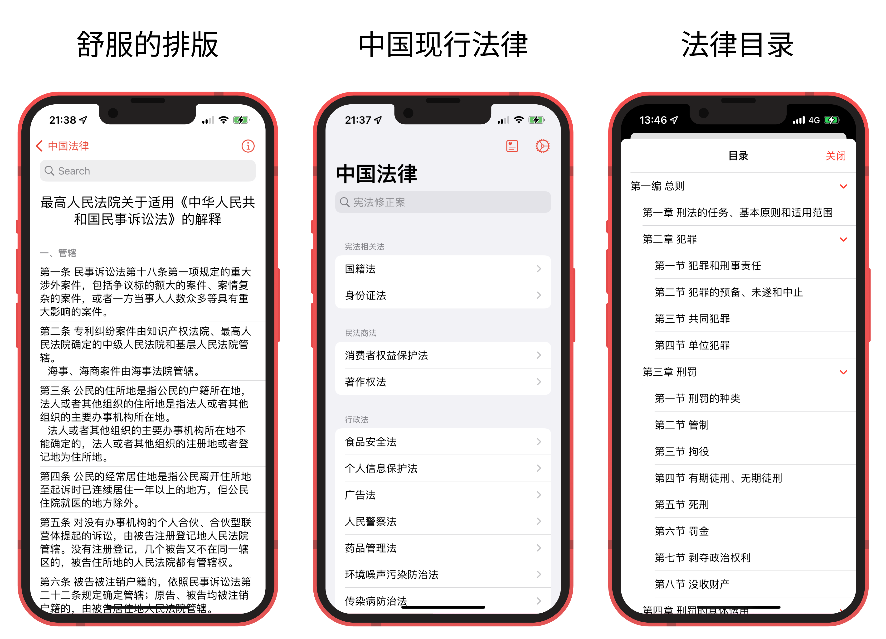

[在线版](https://lawrefbook.github.io/)

# 中国法律

根据《中华人民共和国著作权法》第五条，本作品不适用于该法。如不受其他法律、法规保护，本作品在中国大陆和其他地区属于公有领域。不适用于《中华人民共和国著作权法》的作品包括：
- （一）法律、法规，国家机关的决议、决定、命令和其他具有立法、行政、司法性质的文件，及其官方正式译文；
- （二）单纯事实消息；
- （三）历法、通用数表、通用表格和公式。

法律内容来源于[国家法律法规数据库](https://flk.npc.gov.cn)，该项目仅做整合和搜索等功能，如果您在使用过程中发现部分法条有误，或不完整，请联系开发者进行修改。

# TODO
 - [x] 全文搜索功能
 - [x] 收藏功能
 - [x] 增加宪法修正案
 - [ ] 增加行政法
 - [ ] 增加经济法
 - [ ] 增加社会法
 - [x] 增加刑法及刑法修正案
 - [ ] 完善民法商法
 - [ ] 增加诉讼与非诉讼程序法
 - [ ] 添加旧法，历史库

## 截图

## 贡献
如果你有任何的想法或者意见，欢迎提 Issue 或者 PR

## 贡献指南
app 在设计的时候将法律法规和 app 本身分离开了, 只需要增加法条和修改 law.json 即可添加某部法律..
- 首先将法律法规按照 [法律法规模版](https://github.com/LawRefBook/Laws/blob/bfa4a37153ff582ec3eaafb0a5eebc540732bf75/%E6%B3%95%E5%BE%8B%E6%B3%95%E8%A7%84%E6%A8%A1%E7%89%88.md) 排版好，放入文件夹 `法律法规` 下合适的位置
- 使用脚本 `python3 scripts/auto.py` （脚本会自动处理，将新增法律加入列表以及合适的位置）
- 提交更改，并提 pr

PS 如果你有发现某部法律不完整，有问题，或者需要新增某些，但又不会自己提 pr，你可以在提一个 issue，或者直接联系设置中我的邮箱，我会在下个版本修复或增加
